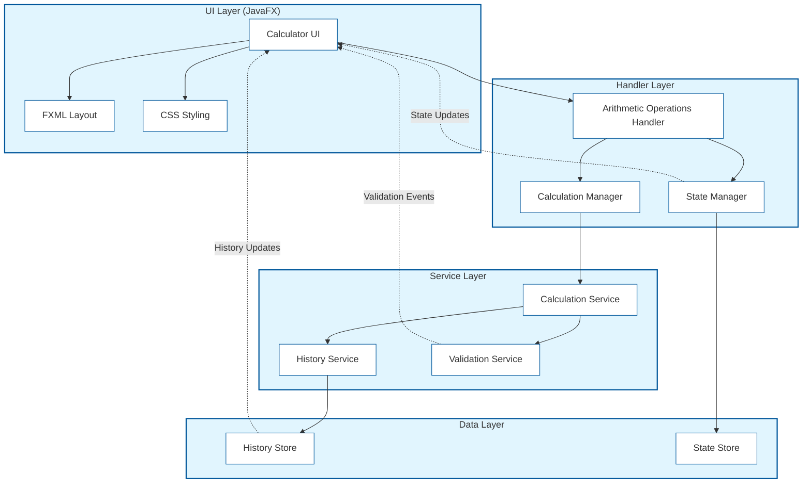

# Arithmetic Operations Handler - Component Architecture

```mermaid
graph TB
    subgraph UI_Layer["UI Layer (JavaFX)"]
        UI[Calculator UI]
        Layout[FXML Layout]
        Style[CSS Styling]
    end

    subgraph Handler_Layer["Handler Layer"]
        AOH[Arithmetic Operations Handler]
        SM[State Manager]
        CM[Calculation Manager]
    end

    subgraph Service_Layer["Service Layer"]
        CS[Calculation Service]
        HS[History Service]
        VS[Validation Service]
    end

    subgraph Data_Layer["Data Layer"]
        HIS[History Store]
        StateStore[State Store]
    end

    %% UI Layer Connections
    UI --> Layout
    UI --> Style
    UI --> AOH

    %% Handler Layer Connections
    AOH --> SM
    AOH --> CM
    SM --> StateStore
    CM --> CS

    %% Service Layer Connections
    CS --> VS
    CS --> HS
    HS --> HIS

    %% Cross-Layer Events
    SM -.->|State Updates| UI
    HIS -.->|History Updates| UI
    VS -.->|Validation Events| UI

    classDef layer fill:#e1f5fe,stroke:#01579b,stroke-width:2px
    classDef component fill:#fff,stroke:#01579b,stroke-width:1px
    
    class UI_Layer,Handler_Layer,Service_Layer,Data_Layer layer
    class UI,Layout,Style,AOH,SM,CM,CS,HS,VS,HIS,StateStore component
```
